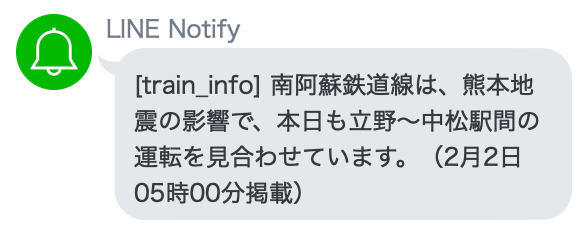

# notify_train_info_git

# アプリ名
電車遅延通知アプリ

# 背景
出勤時等に使用する路線が遅延で遅れていると駅で数分の待ち時間が発生し、目的の場所への到着が遅れる可能性がある。  
常時運行情報を確認することは煩雑な為、特定の路線が遅延した時に自動で通知する機能が必要である。

# 仕様
特定のyahoo路線の運行情報をスクレイピングし、正常運行以外の場合にLine notifyにて運行情報を通知する  
※Heroku等のserver上で定期実行させることを推奨

### LINE通知画像

*  遅 延発生時  

      
* 異常時  
  

# 主な使用技術
  * スクレイピング：Beautiful Soup
  * ライン通知：Line notify

# その他
* 注記：本処理はスクレイピング処理を使用している為、過度な実行はアクセス先serverに負荷がかかり、ユーザーのIPアドレスがブロックされる可能性がある。その為、実行間隔をスケジューラ等を利用してserverに負荷がかからないようにする調整する必要がある。

